# CBS论文分享

[toc]

## Conflict-based search for optimal multi-agent pathfinding

- Abstract

  - MAPF:multi-agent path finding,多个个体各自有起点和目标点，任务是给所有个体找到保证不碰撞的路径。

  - CBS，two-level algorithm

    - high-level *Conflict Tree* , conflicts between individual agents

      CT node: a set of constraints on motion of the agents

    - low-level 满足constraints 的搜索

  - MA-CBS 允许几个agent 可以merge成一个团体

- Introduction
  - *optimal* and *sub-optimal* solvers. NP-hard 状态空间跟代理数量成指数关系
  - 传统MAPF解决方法是使用A*， node是在时间t时候的一系列位置，可以保证最优化但运行时间较长并且占用内存较大
  - CBS是两层搜索的算法，high-level在执行时会生成一些列对时间-位置的限制
  - MA-CBS算法减轻了CBS的最差性能，通过预定义参数B限制了冲突数，当冲突数大于B，冲突的agents就被merge到一个 meta-agent里作为一个联合agent

- Problem definition and terminology

  - Problem input
    - graph：vertics are possible locations for the agents and the edges are the possible transitions between locations
    - k agents，每一个有独立的起始点和目标点 starts and goals

  - actions
    - move：移动到相邻vertex
    - wait：

  - MAPF constraints
    - 一个顶点在同一给定时间只能被最多一个agent占住
    - 多个个体在同一时间同一个边上移动

  - MAPF task
    - solution：一些列不冲突的路径，对单个ai个体来说，一系列{move，wait}的动作从起点到终点

  - cost fuction
    - sum-of-cost：所有个体从起点到达终点所有的时间和
    - makespan：单个个体路径的最长时间
    - Fuel：所有个体走过的路径长度和
    - 没有一个总的全局的cost，但可以每个agent一个独立cost function 

  - Distributed vs centralized

    - distributed:每个agent有自己的算力，和通信方式

    - centralized：一个独立算力为所有个体寻路

- Survey of centralized MAPF algorithms

  - reduction-based solvers： 只适用于makespan这种cost function， 和agent 数量小
  - MAPF-specific sub-optimal solvers：不能保证最优性和完备性
    
  - search-based suboptimal solvers：例子HCA*， 根据预设定顺序每次规划一个。前头搜出来的路会block后续个体的搜路。WHCA * 加了一个滑窗，滑窗外的个体被忽略。
    
  - MAPF-Optimal MAPF solvers

    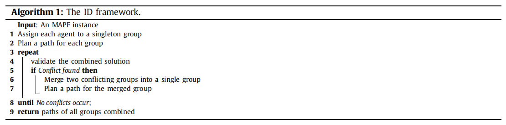

- CBS

  - Definitions for CBS
    - path: for single agent   solution: k paths for given set of agents
    - constraint: (ai,v,t) ai 不能在t时刻在v这个位置上
    - conflict （ai， aj， v，t） 两个agent ai和aj在t时刻都在v这个位置上

  - High level

    - The constraint tree限制树
      - A set of constraints：每个限制条件都属于一个agent，CT的root节点没有限制条件，子节点继承父节点所有限制条件并增加新的限制条件给父节点
      - A solution：k paths
      - The total  cost

    - Processing a node in the CT 限制树节点处理过程，对于节点的solution，判断是否有conflict存在
    - Resolving a conflict 
      - 对于一个冲突（ai，aj，v，t），节点N生成两个子节点，左边（ai，v，t）右边（aj，v，t）
      - low-level search只用查找跟新添加限制相关的agent，其他agent保持不变

    - conflicts of k>2 agents

      - 生成k个子节点，每个子节点有k-1个限制条件

      - 只关注冲突的前两个agents，根据这两个agent生成子节点

        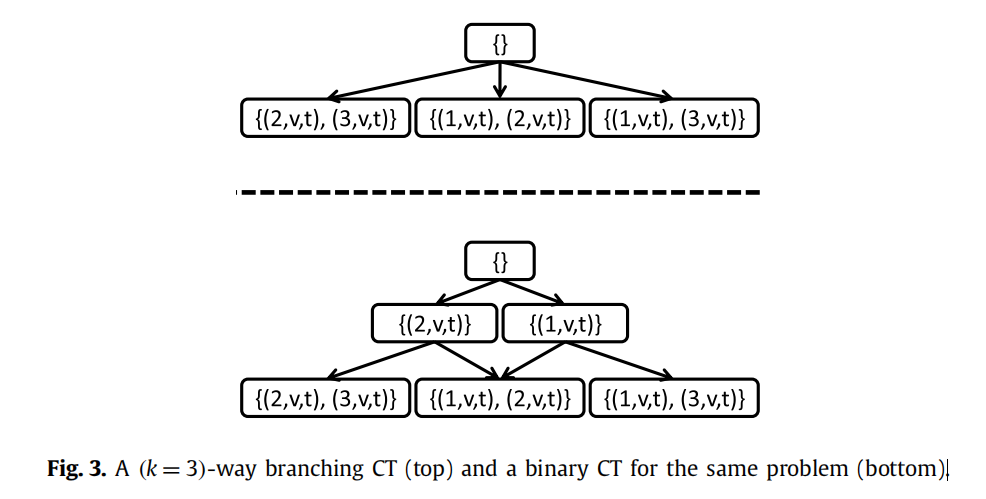

    - Edge conflicts (ai, aj, v1, v2, t)

      agents are not allowed to cross the same edge at opposite direction

    - Pseudo-code

      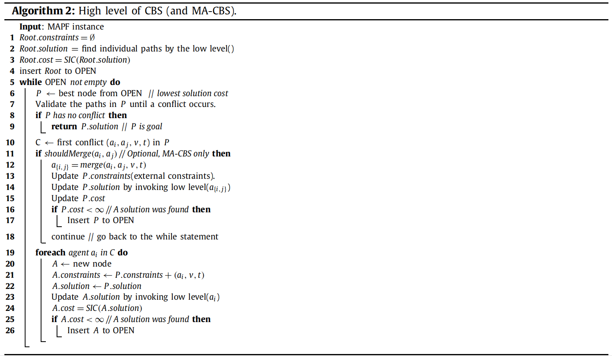

      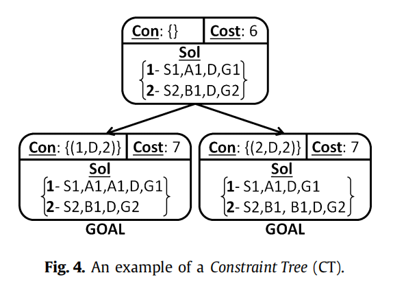

  - Low level : find paths for CT nodes
    -  如果有一个constraint （ai，v，t），A* 的状态（v，t）会被舍弃
    - 如果A*里的两个状态有相等的f cost，那么哪个状态碰撞个体数越少，优先遍历这个

- Theoretical analysis

- CBS empirical evaluation

  - Experimental Problem settings
    - 个体从不消失，如果个体到了目标点，也有可能挡住其他个体的路
    - 如果到达终点且不再移动，wait不产生cost，否则产生
    - 允许following， i： x->y 同时 j：y->z
    - 存在edge conflict
    - low-level用了DD
    - cost： sum-of-cost

  - Experimental results

    - 8*8 4-connected grid map

      agent 3-21

      time limit:  5 min

      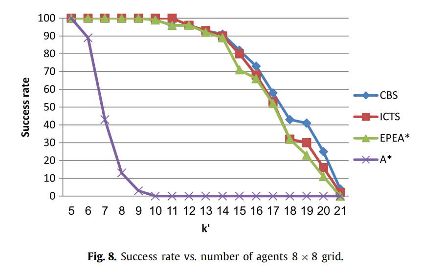

      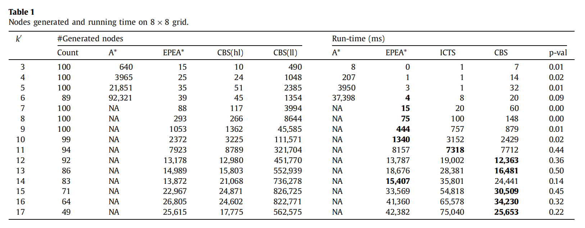

    - DAO maps

      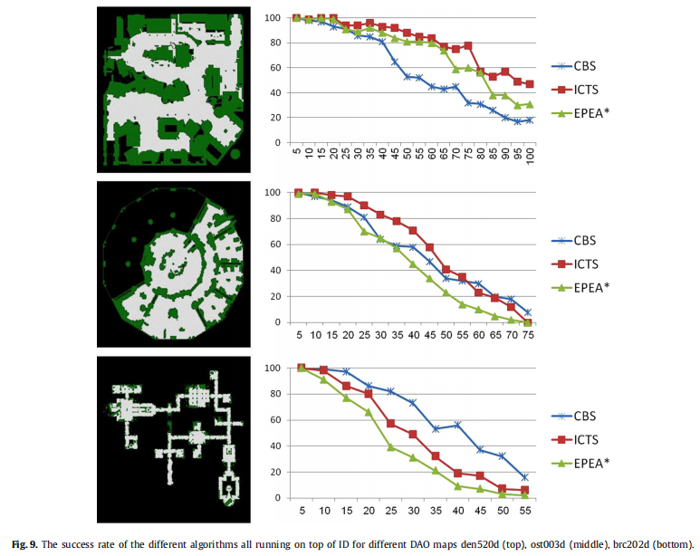

      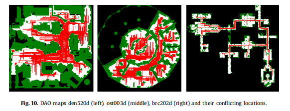

      - 有走廊和瓶颈地方CBS表现较好，开阔地方CBS表现较差

- CBS using different cost functions
  - High level:makespan
  - Low level
  - Optimality
  - Completeness

- Meta-agent conflict based search

  - motivation for meta-agent CBS
    
  - As explained previously, CBS is very efficient (compared to other approaches) for some MAPF problems and very inefficient for others.
    
  - Merging agents into a meta-agent
    - branch:生长子节点
    - merge:把conflict的agent合并进一个meta-agent，meta-agent不会进行分裂，只会被merge进另外的meta-agent
    - 其他agent没变，只增加了这个meta-agent，那么low-level search只搜索meta-agent的路径

  - Merge policy
    - 预定义参数B： conflict bound parameter
    - CM[i,j] ： 冲突次数

  - Merging constraints

    - meta-agent中的子集不允许在时刻t在位置v上

    - meta-agent的子集和另一个meta-agent的子集在位置v时刻t冲突

    - merge以前的冲突

      - internal：conflicts between i&j

        external（i）： conflict between i&k（other agent）

        external（j）：conflict between j&k

      - Merging external constraints

  - The low-level solver
  - Completeness and optimality of MA-CBS
  - MA-CBS as a continuum
    - MA-CBS（无穷）跟基本的CBS是等价的
    - MA-CBS（0）跟 indenpendence detection 一样conflict就merge

- MA-CBS Experimental results

  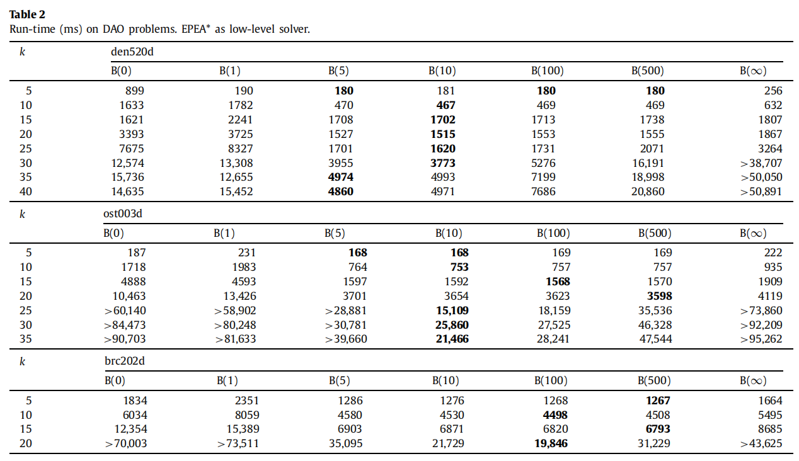

  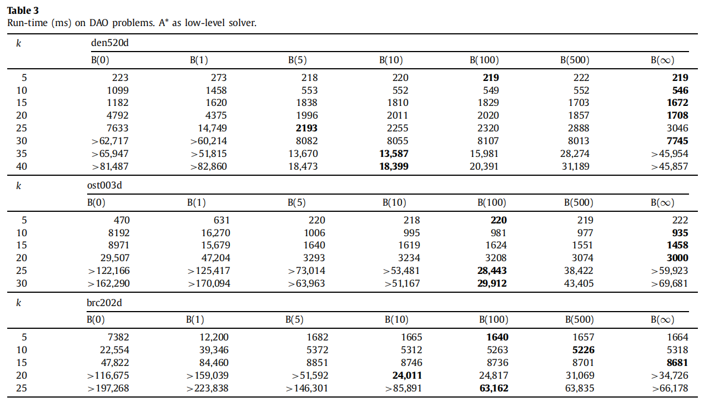

  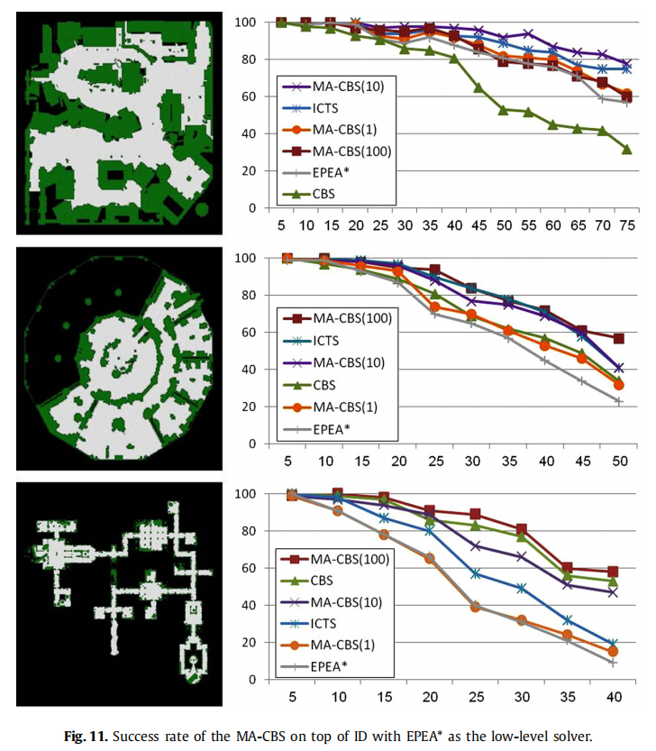

  - 带有B值的MA-CBS要比CBS和EPEA*要更好，比ICTS要好
  - 冲突的数量和比例越大，B的值越小越好

  - 结论：算法的表现跟 密度 和 地图拓扑结构 碰撞发生数量 初始启发项有关
    - 密度越大，B的值越小越有效
    - 开阔地方多，瓶颈和走廊地方少，B越小越好
    - 如果low-level算法比较弱，B越大越好

## Multi-Agent Pathfinding with Continuous Time

- Introduction

  - assumation
    - time is discretized into time steps时间被离散成timestep
    - 每一个动作的周期都在同一个time step里
    - 单个time step只能在一个位置上

  - 运用了SIPP和CBS
  - CBS依赖可以准确发现碰撞和计算safe interval 一个个体无碰撞沿一条边移动的最小时间
    - 闭环碰撞检测公式
    - 离散化的安全间隔计算方法

  - 可以处理非单位动作周期，连续时间，非网格化

- Problem Definitions
  - 假设
    - 尺寸相同
    - 速度相同且恒定
    - 在同一地图环境下
    - 惯性被忽略

- CBS with Continuous Times

  - From CBS to CCBS
    - geometry-aware collision detection
    - geometry-aware unsafe-interval detection
    - 动作-时间范围 vs 位置-时间 限制
    - low-level SIPP

  - Conflict Detection in CCBS

    可能会有走两个边的时候的碰撞和一个move一个wait产生碰撞

  - Resolving Conflicts in CCBS
    
  - 在生长子节点时，CCBS计算了每个动作的不安全间隔，个体i动作产生碰撞的最大时间间隔
    
  - SIPP
    - 处理连续时间和移动障碍物，safe interval 安全间隔：最大连续时间-一个个体可以停止或者到达V不碰撞动态障碍物
    - 限制条件
      - move：删除这个动作并且变成wait的动作
      - wait：分解成两个time range

- Partial Aspects
  - Conflicts Detection and Selection Heuristics
    - past-conflicts heuristics
    - cardinal conflict: 重新规划后SOC增长
    - 先选择cardinal conflict，如果没有主要冲突后，用past-heuristics

- Experimental Results

  - Open Grids
    - k提高Soc降低
    - k提高，path-finding变难，成功率降低

  - DAO MAPS
    - increasing k reduces the SOC and decreases the success rate.

  - Conflict Detection and Resolution Heuristics

## Improveing Continuous-time Conflict Based Search

- Background and Problem Statement

  - CBS

    - Low-Level Search
    - High-Level Search

  - CCBS

    - conflict:(ai,ti,aj,tj) :agent i action ai at ti, agent j action aj at tj will conflict
    - constraint:(i,ai,[ti, tiu))：[ti，tiu）时间范围内，不允许执行ai动作

  - CBS-DS:解决CBS生成子节点时的低效率：会有一些solution满足两个限制

    negative：agent i must not be at x at time step k

    positive：agent i must be at x at time step k

    fact landmark：positive constraint ， low-level search 搜索一个地标到另一个地标满足；agent goal是最后一个地标

    - Positive and Negative Constraints in CCBS
      - negative：[ti, tiu) is not a plan for agent i
      - positive：[ti, tiu) is a plan for agent i
      - action landmark: positive constraint 

    - Low-Level Search In CCBS-DS
      - （1）search for a plan for si to A (2) move from A to B (3) search for a plan from B to gi
      - Example

  - Prioritizing Conflicts

    - 如何选择要解决的冲突，会造成CT的尺寸差异，从而造成运行时间差异。

      cardinal：主要冲突，两个子节点的cost高于父节点

      semi-cardinal：次要冲突，有一个子节点高于父节点

      non-cardinal：以上都不是

    - cost impact：解决冲突时候，solution cost增加了多少

  - Heuristics for High-Level Search

    计算了CT node跟最优解之间的 cost 差
