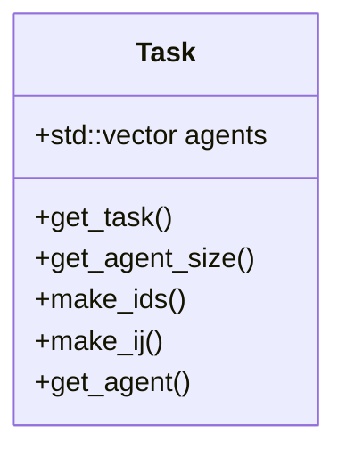
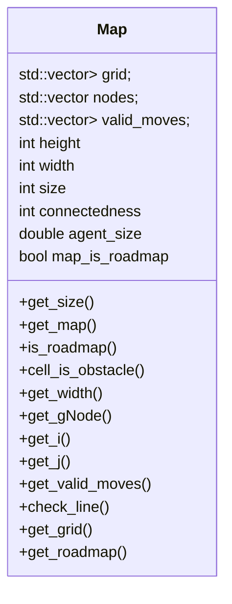
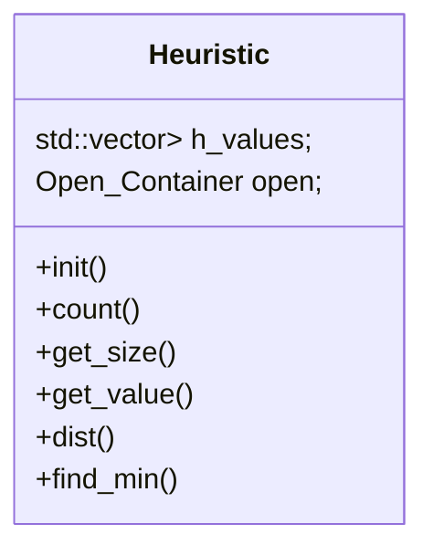
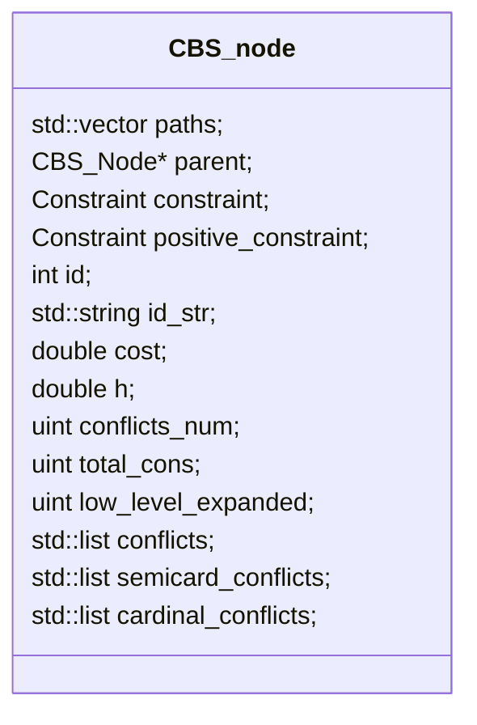
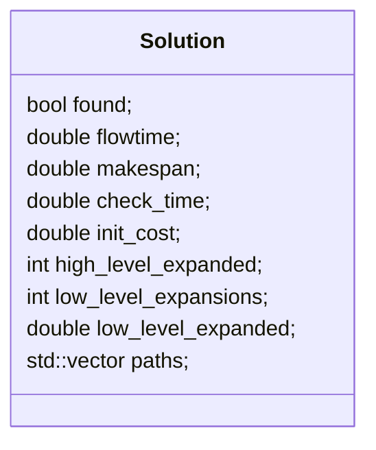
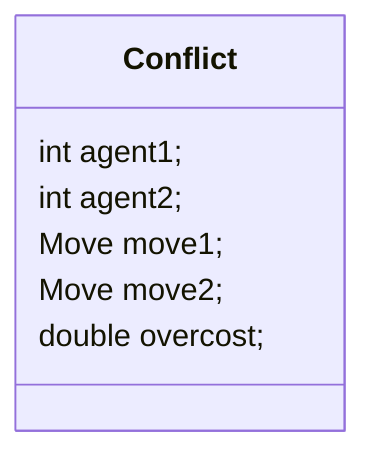

## CCBS源码阅读笔记

1. CCBS 类图

   ```mermaid
   classDiagram
         class CBS{
             +find_solution()
             +init_root()
             +get_constraints()
             +validate_constraints()
             +check_positive_constraints()
             +check_paths()
             +check_conflict()
             +get_hl_heuristic()
             +get_all_conflicts()
             +get_constraint()
             +get_wait_constraint()
             +find_new_conflicts()
             +get_cost()
             +get_paths()
             +get_conflict()
                       
             +CBS_Tree tree
             +SIPP planner
             +Solution solution
             +Heuristic h_values
             +Config config
             +const Map* map
             
         }
   ```

   ```mermaid
   classDiagram
         class Config{
         	  +getConfig()
             +double precision
             +double focal_weight
             +bool use_cardinal
             +bool use_disjoint_splitting
             +int hlh_type
             +int connectdness
             +double agent_size
             +double timelimit
         }
   ```








2. CCBS调用流

```
1.Config config->getConfig //获取config参数
	root/algorithm/precision/use_cardinal/use_disjoint_splitting/connectedness/focal_weight/agent_size/hlh_type/timelimit
2.Map map->get_map
	root ? grid_map(get_grid) : road_map(get_road_map)
	get_grid: parse: height/width/grid  size=width*height; valid_moves;
	get_roadmap: parse: node/edge valid_moves
3.Task task->get_task task->make_ij or task->make_ids
	get_task: parse: root agents(Agent:start_i/start_j/start_id/goal_i/goal_j/goal_id/id)
	make_ij: road_map: map->get_gNode: return nodes[id];
	make_ids: start_id = i*width+j
4.CBS cbs->find_solution(map, task, config)
	for(agent) h_values.count(map,agent)//todo: understand
	init_root:root:paths=find_path;cost+=path.cost;low_level_expanded=0;parent=nullptr;id=1;id_str="1";
				   conflicts= get_all_conflicts(root.paths, -1);
		        !use_cardina:root.conflicts.push(conflict):pathA.cost&&pathB.cost>origin_cost:cardianl_conflict:semi_conflict
			solution.init_cost = root.cost
			tree.add_node(root)
    	
```







